# PhotoX

Personal photo and video hosting platform: one NestJS API (`core`), one BullMQ worker (`worker-service`), and a Vite/React `web` app, sharing Redis and local-disk storage, with a single Postgres DB owned by `core`.

## Architecture

[](docs/diagrams/architecture.html)

## Upload processing

[](docs/diagrams/data-flow.html)

## Prerequisites

- Node.js 22 (`.nvmrc`)
- pnpm 9.15 (see `packageManager`)
- Docker & Docker Compose

## Quick Start

```bash
# Install dependencies (also seeds worker models; FACE_MODEL_SKIP=1 to skip)
pnpm install

# Configure env (AUTH_TOKEN_SECRET is required, >= 32 chars)
cp .env.example .env

# Start infrastructure
docker compose up -d postgres redis

# Run all apps in dev mode (hot reload)
pnpm dev

# Open the web app
open http://localhost:5173
```

Infrastructure only: `docker-compose.yml` runs `postgres` + `redis`. The e2e stack (`docker-compose.e2e.yml`, used by `pnpm test:e2e`) is self-contained and additionally builds/runs `core`, `worker-service` and `web` in containers.

## Commands

| Command                    | What it does                                                                                           |
| -------------------------- | ------------------------------------------------------------------------------------------------------ |
| `pnpm dev`                 | core + worker-service + web with hot reload                                                            |
| `pnpm build`               | build all packages                                                                                     |
| `pnpm test` / `test:watch` | unit + integration tests (integration uses Testcontainers — Docker must be running)                    |
| `pnpm lint` / `typecheck`  | ESLint (type-aware) / `tsc --noEmit` across all packages                                               |
| `pnpm format`              | Prettier write                                                                                         |
| `pnpm test:e2e`            | boot the self-contained e2e stack, then run the Playwright/BDD suite (report: `e2e/playwright-report`) |
| `pnpm verify`              | CI order: lint → `test --force` → typecheck → build → `E2E_BUILD=1 test:e2e`                           |

Single app: `pnpm --filter @photox/core dev` (also `@photox/worker-service`, `@photox/web`); any package script accepts the same `--filter`.

### Flags and env

- `--e2e-workers=N` — `pnpm verify --e2e-workers=4` / `pnpm test:e2e --e2e-workers=4`: run the parallel `suite` project with N Playwright workers (default `1`, fully serial). The `setup` project — first-user-admin bootstrap plus the admin face/semantic features that mutate global state — always runs first and serially.
- `E2E_BUILD=1` — rebuild the `photox-e2e-*` images before booting the stack (`pnpm verify` sets it); without it existing images are reused.
- `E2E_KEEP=1` — keep the stack running after the suite (prints the web URL) and skip artifact cleanup.
- `E2E_PROJECT=` / `E2E_WEB_PORT=` — override the auto-generated compose project / web port. Each invocation is stack-isolated, but `e2e/.features-gen`, `e2e/test-results` and `e2e/playwright-report` are shared between concurrent runs.
- `FACE_MODEL_SKIP=1 pnpm install` — skip the postinstall worker-model download.
- `pnpm --filter @photox/worker-service face-model` — (re)download worker models: `face-model`, `vision-model`, `ocr-model`, `detect-model`.

Core health check (host dev): `curl localhost:3000/health`; Swagger UI at `http://localhost:3000/docs`.

## Services

| Service        | Port       | Description                                                                                |
| -------------- | ---------- | ------------------------------------------------------------------------------------------ |
| core           | 3000       | The only HTTP API (auth, assets, files, albums, shares, faces, admin)                      |
| worker-service | (internal) | BullMQ consumers (thumbnails, video, metadata, OCR, embeddings, detection, faces, cleanup) |
| web            | 5173       | React frontend (proxies `/api` to core)                                                    |
| postgres       | 5432       | PostgreSQL (pgvector image; single `photox` DB)                                            |
| redis          | 6379       | Redis (BullMQ queues)                                                                      |

Storage is local disk (`STORAGE_DIR`, default `./data/storage`) shared by core and worker — no object store.

## Layout

- `apps/core` — NestJS API (`@photox/core`)
- `apps/worker-service` — BullMQ consumers (`@photox/worker-service`), no DB access — talks to core over HTTP
- `apps/web` — Vite + React (`@photox/web`)
- `apps/core/src/database` — TypeORM entities + DB module (core only)
- `packages/shared-config` / `shared-types` — zod env + local storage, JWT payload/wire types
- `e2e` — Playwright + playwright-bdd suite (self-contained container stack, `pnpm test:e2e`)

See `AGENTS.md` for architecture details.
